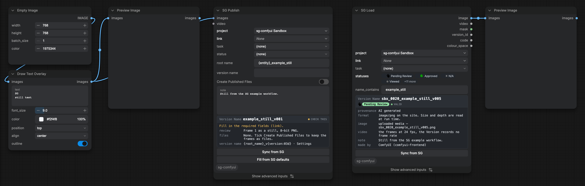
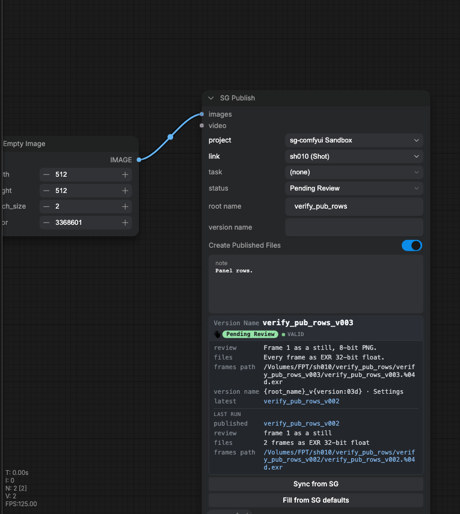
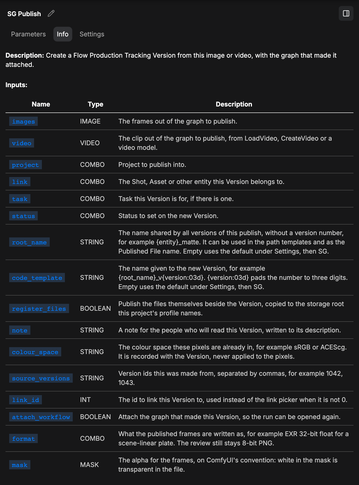
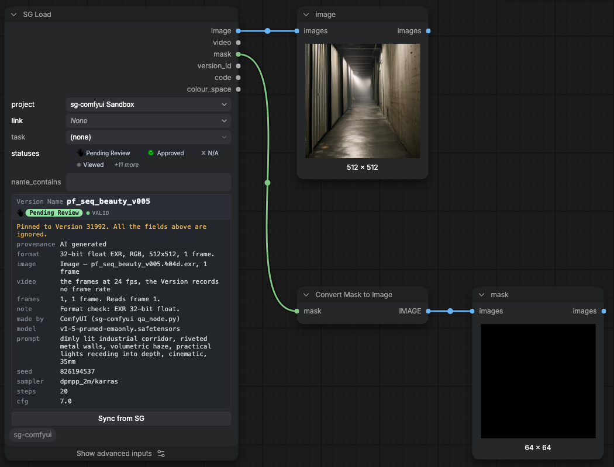
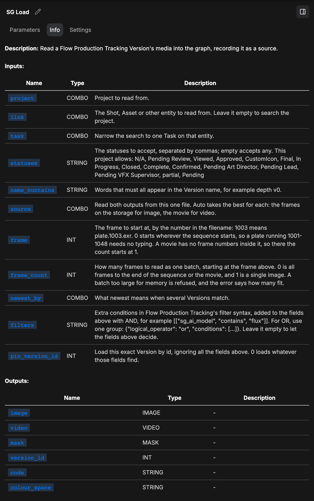
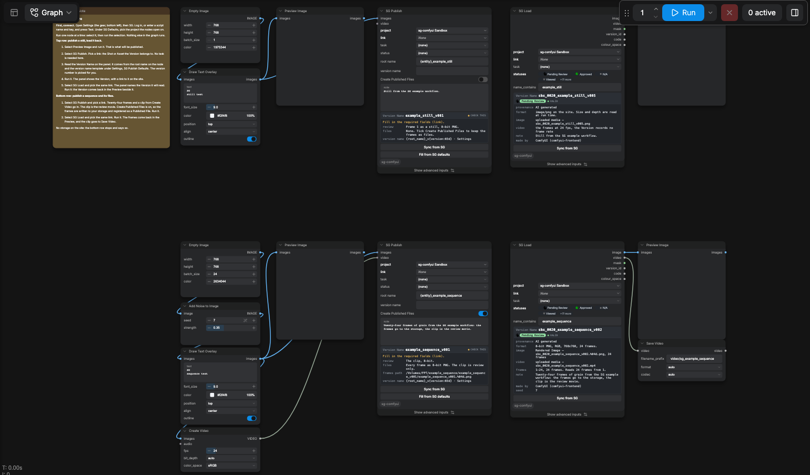

# Flow Production Tracking for ComfyUI

Two ComfyUI nodes that record a generation in Flow Production Tracking, formerly ShotGrid.

- **SG Publish** creates a Version from an IMAGE or a VIDEO, uploads the media, and attaches the
  model, prompt, seed, sampler and workflow that made it.
- **SG Load** reads a Version's media back into a graph as image, video and mask.
- Nothing here generates, encodes or decodes. ComfyUI writes and reads the pixels.



## What it provides

### SG Publish

- Creates a Version linked to a Shot, an Asset, or whatever your site links Versions to.
- Reads project, link, Task and status live from your site.
- Writes nine typed fields: generator, model, prompt, negative prompt, seed, sampler, steps, CFG,
  lineage.
- Attaches the workflow and a `.provenance.json` record.
- Uploads review media that plays in a browser.
- Registers the frames or the movie as PublishedFiles when **Create Published Files** is ticked.
- Writes frames as 8-bit PNG, 16-bit PNG or EXR 32-bit float, picked on the **format** widget.
- Writes a wired **mask** as the frames' alpha, on ComfyUI's convention: white in the mask is
  transparent in the file.





### SG Load

- Finds a Version by project, link, Task, status and name. `pin_version_id` takes an id instead.
- Outputs `image`, `video`, `mask`, `version_id`, `code`, `colour_space`.
- Reads 16-bit PNG and EXR at full precision.
- Records the Version it read on anything published downstream.





### In the editor

- **Settings**, then **SG**: site address, sign-in, project, publish defaults.
- **SG Site Setup**, in that group: counts the nine provenance fields on the site, creates the
  missing ones.

## Install

| requirement | value |
|---|---|
| ComfyUI | 0.34.0 or newer |
| Python | 3.11 |
| Site | a Flow Production Tracking site you can log into |
| Client | `sg-groundtruth`, installed by `requirements.txt` |

### Which install

| install | what you get | updates |
|---|---|---|
| ComfyUI Manager or the Registry | the pack as released | Manager. An edit inside the pack is lost at the next update |
| A checkout | the repository: the pack, the tests, the tools, the site. Customize it with an agent, run the suite, fork it | `git pull` |

Both include `CLAUDE.md` and the commands under `.claude/commands/`, so `/setup`, `/inspect-site`,
`/task` and `/track-workflow` run from either.

### ComfyUI Manager

Open **Manager**, then **Custom Nodes Manager**. Search for `Flow Production Tracking`. Press
**Install**. Restart ComfyUI.

### The Registry

The pack is `sg-comfyui` at https://registry.comfy.org/nodes/sg-comfyui. With the Comfy CLI:

```sh
comfy node install sg-comfyui
```

Restart ComfyUI.

### A checkout

```sh
cd ComfyUI/custom_nodes
git clone https://github.com/ksallee/sg-comfyui.git
cd sg-comfyui
<comfy-python> -m pip install -r requirements.txt
```

Restart ComfyUI.

`<comfy-python>` is the interpreter ComfyUI runs on. Check the install with it:

```sh
<comfy-python> tools/doctor.py
```

Paths, the command-line tools, the profile key by key and the fixes are in [INSTALL.md](INSTALL.md).

## First run

1. Open **Settings**, then **SG**.
2. Enter your site address under Connection.
3. Press **Log in**, then approve the request in the browser tab.
4. Press **Test**.
5. Pick the project under **SG Defaults**.
6. Open the **Templates** browser, category **sg-comfyui**, and open `00_example`.
7. Pick a link on each node.
8. Press **Run**.

A farm enters a Script name and Application key under Script Authentication instead of step 3.
An agent follows the same steps with `/setup`.



Restart ComfyUI only to install or upgrade the pack. A profile edit is read on a browser refresh.

## How it works

### Where provenance is written

Nine typed fields on Version, created under **Settings**, then **SG**, **SG Site Setup**.

| field | programmatic name | from |
|---|---|---|
| AI Generator | `sg_ai_generator` | ComfyUI, and the name the submitting client gave itself |
| AI Model | `sg_ai_model` | the checkpoints the graph loaded |
| AI Prompt | `sg_ai_prompt` | positive conditioning on this branch |
| AI Negative Prompt | `sg_ai_negative_prompt` | negative conditioning on this branch |
| AI Seed | `sg_ai_seed` | text, not a number: seeds reach 2\*\*64-1 (probe 019) |
| AI Sampler | `sg_ai_sampler` | sampler and scheduler |
| AI Steps | `sg_ai_steps` | the last sampler on the branch |
| AI CFG | `sg_ai_cfg` | the last sampler on the branch |
| AI Generated From | `sg_ai_generated_from` | the Versions this was made from |

- A site with none of these fields records the facts in the Version's description.
- Where some of them exist, those take their values. The description records the rest.
- The record is attached as `.provenance.json`.
- The workflow is attached when the submitting client sent one.
- Provenance is scoped per branch. The node walks back through its own inputs.

### The frames and the storage root

- A Version has one uploaded media file (probe 022). `sg_path_to_frames` and `sg_path_to_movie` are
  path references, and RV reads them to switch between the transcode and the source. The only
  out-of-the-box way to register an image sequence is a PublishedFile linked to the Version.
- A PublishedFile's path is under one of your site's Local File Storage roots. The server refuses
  any other path.
- ComfyUI writes the frames to its own output directory. The node copies them under the root.
- Originals are never moved. A publish that fails after the copy names the copies it left.
- Sequence path, Still path and Movie path are the three templates, under **Settings**, then
  **SG**, **SG Publish Defaults**.
- The same three are advanced inputs on SG Publish. A filled one applies to that publish. An
  empty one shows the Settings template greyed inside the field.
- A batch of one frame is written by Still path, beside the folder a sequence takes.
- `{version}` is the publish revision. `%04d`, `####` and `@@@@` are the frame number.
- The extension follows the files, not the template.

### Formats and colour space

- A VIDEO read from a file is uploaded as that file, byte for byte.
- Anything else is written by ComfyUI's `VideoInput.save_to()`, with its colour space, bit depth and
  audio.
- Review media is 8-bit.
- Colour space is recorded, never applied.
- The declared value goes in the PublishedFile's description. SG Load returns it as an output.
- Core ComfyUI has no colour management. INSTALL.md says what to install.

### What it does not do

- No encoder, no decoder, no generation.
- No charts, no dashboards, no scheduled reports, no automations.

## Customize

`profile.local.json` sets what a Version links to, what it is called, and which field each
provenance fact is written to. It is plain JSON. Edit it by hand.

| to do this | use |
|---|---|
| Measure one project and write the profile | `/inspect-site` |
| Set the name templates, status, storage and paths per project | Settings, then SG, SG Publish Defaults |
| Put a Settings template on a node | type `{` in root name or version name, then pick Default |
| Map provenance onto Version fields you already have | the profile's `provenance.map` |
| Add the nodes to a graph you already use | `/track-workflow` |

Without a measured profile the pickers run on the site's own defaults, which suit a Shot-linked show.
The procedures are in `.claude/commands/` as plain markdown. `01_concept_and_style` and
`02_style_from_a_reference` are worked graphs.

## What's next

The order is not decided. Open an issue for the one you need, whether or not it is on this list.

- Registering files another node wrote, such as Save Image (Advanced) or an OCIO Write.
- Publishing where there is no shared storage, by uploading a zip.
- Publishing on someone's behalf, and naming the artist on a farm.
- Newest per stream, rather than newest on the link.
- Version fields and linked fields as inputs on SG Publish: a field search in Settings, a
  re-orderable list, each field a normal or advanced input.
- A colour-managed template.
- Publishing from a Windows machine is untested. You can contribute.

## Known limits

- A loader inside a ComfyUI subgraph is replaced there, not promoted to the top level.
- A zip uploaded to a Version is not unpacked. SG Load returns it unchanged.
- `pyproject.toml` has no `Icon`.

## Where to read next

| file | what it is |
|---|---|
| [INSTALL.md](INSTALL.md) | the interpreter, the local files, the command-line tools, the profile, the fixes |
| [DESIGN.md](DESIGN.md) | why each decision was made |
| [AGENTS.md](AGENTS.md) | the entry point for an agent |
